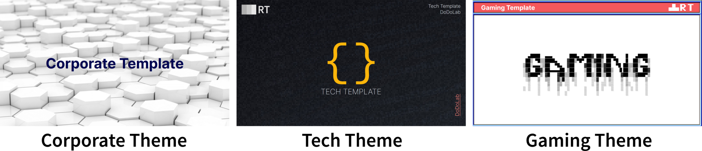
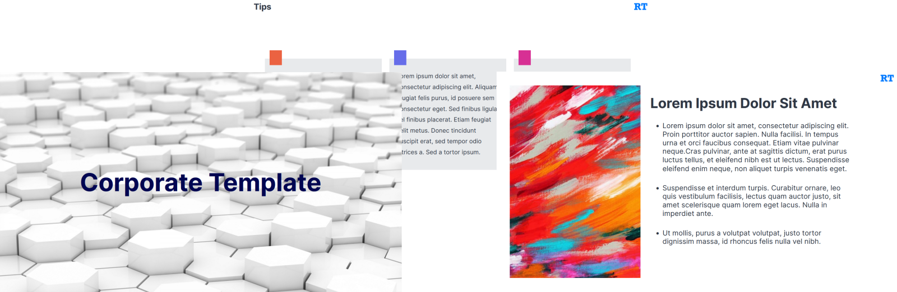
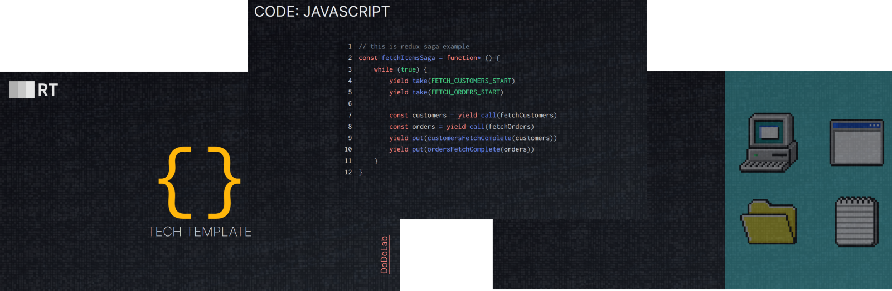
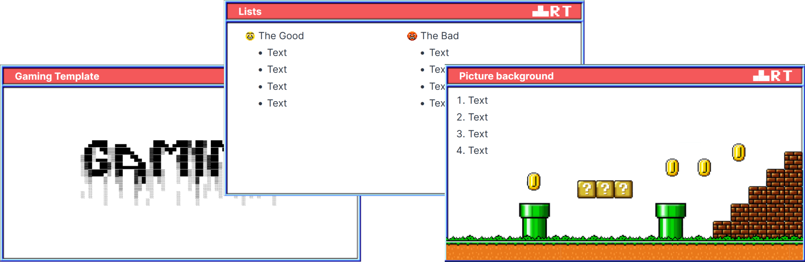
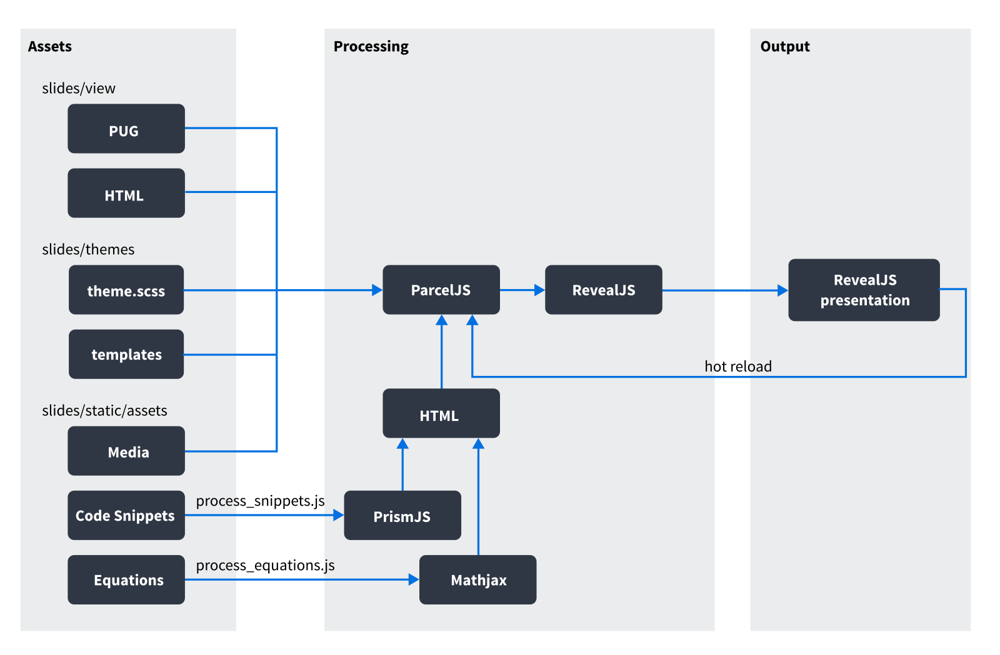
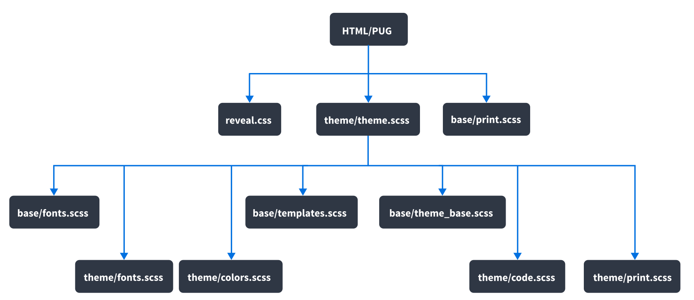

# RevealJS-Template

[](https://aphgames.io/docs/learning/intro)

A template built on top of [RevealJS library](https://revealjs.com/) for my lectures, workshops, and labs.

By using this template, you will be able to quickly write HTML presentation slides for your knowledge-sharing sessions.

Interested in some examples? [Here they are!](https://aphgames.io/slides/index.html)

## Features
- Tailwind-like utility-first SCSS templating
- PUG declaration
- various mixins and themes
- build-time equations and code snippets

## Install & Run

Make sure you have nodejs `16.0.0` or higher and npm `8.6.0` or higher installed. Install dependencies with:

```bash
npm install
```

Once it's done start up a local server with:

```bash
npm run dev
```

To view the demo slides, go to:
- [localhost:1234/demo-corporate.html](http://localhost:1234/demo-corporate.html) to see the corporate theme
- [localhost:1234/demo-tech.html](http://localhost:1234/demo-tech.html) to see the tech theme
- [localhost:1234/demo-gaming.html](http://localhost:1234/demo-gaming.html) to see the gaming theme
- there are two modes - preview and presentation mode. Presentation mode reveals all fragments gradually and can be enabled by applying `?presentation` query string, for instance `localhost:1234/demo-gaming.html?presentation`

To create a production build:

```bash
npm run deploy
```



## How to use this template
- pick up the theme you want to use (at the moment, there are 3 themes: corporate, gaming, and tech)
- each theme has its own demo presentation in the `slides/view` folder
  - themes are written in [PUG](https://pugjs.org) language, but you can use HTML as well
- enter the directory of the theme and perform necessary changes:
  - if you want to add new fonts, add them in the `fonts` folder and put all declarators in `fonts.scss`
    - the following fonts are preinstalled: **Roboto, Inter, Inconsolata**
  - if you want to change the colors, edit the `colors.scss` file
  - if you want to add new mixins (macros) for your slides, add them into the `containers.pug` file inside the theme folder
  - any theme-specific styles should be put in `theme.scss` in the theme directory
  - all theme-specific assets, such as logos, frames, and icons, should be put in the `resources` folder in the theme directory
- modify the demo file as you like

### Corporate Theme


### Tech Theme


### Gaming Theme


### What is RevealJS
- [RevealJS](https://revealjs.com/) is a HTML Presentation Framework
- **main features**
  - horizontal and vertical slides
  - [wysiwyg](https://slides.com), but that's for ladies
  - code snippets
  - animations
  - touch optimized
  - easily exportable (e.g. as an Android app by using Cordova)
  - highly customizable (themes, transitions, backgrounds,...)
  - supports iframes, video, canvas,...
  - export to PDF (via Chrome and some CSS modifiers)
  - lots and lots of [plugins](https://github.com/hakimel/reveal.js/wiki/Plugins,-Tools-and-Hardware), such as speakers view, elapsed time bar, charts, D3.js, menu, virtual laser pointer 
  - contains API to manipulate with the library from your JavaScript code

## How it works

- **this repository has its own pipeline** that makes things much more powerful
- everything is bundled together via `ParcelJS` which also supports hot reload - Parcel just goes over your html/pug files in the `slides/view` folder and bundles and generates the output files for you
  - **keep in mind that not everything can be hot-reloaded**
  - Parcel only hot-reloads files that are statically referenced in the HTML/PUG file or any other file (styles, scripts) it references
  - slide backgrounds are loaded dynamically via a data attribute, therefore they need to be copied to the output folder via a script (that's why there is a `prebuild.js` script that will copy all dynamic files to the output folder)
    - in order not to copy some files twice, it will copy all folders in the `assets` folder that don't have a file named `.dontcopy`. By default, it only copies `backgrounds` and `plugins` folder
- code snippets and equations are processed first, because there is a script that needs to generate html files from them before Parcel starts bundling the data. These files are referenced statically via `include` declarator (see the demo files). These folders are named `snippets_generated` and `equations_generated` and are ignored by git, as they are re-generated every time you run `npm run dev`

### Pre-installed RevealJS plugins
- notes - Handles opening of and synchronization with the reveal.js notes window, [here](https://revealjs.com/speaker-view/) is the documentation
- pointer - higlights a mouse pointer when you press Caps Lock
- search - Handles finding a text string anywhere in the slides, accessible by pressing `CMD+SHIFT+F`

### Export to PDF
- you can export anything to pdf just by adding `?print-pdf` to the url, it will switch to appropriate CSS mode and you can use `Chrome` pdf export feature
- you should use `Google Chrome` since it has got a built-in PDF export and the slides were optimized for it
- navigate to a presentation you want to export either on your localhost or in the live environment and put `?print-pdf` as a query string (e.g. `localhost:1234/demo-gaming.html?print-pdf`)
- in this mode, you will see all slides aligned vertically, stripped out of all visual effects and glowing backgrounds
- press the right mouse button, select `print`
- select `Save as PDF` as the Destination
- wait for the preview to be generated and click on `Save`

### Keyboard shortcuts
| Key | Action | 
| ------ | ------ | 
| N, SPACE | Next slide | 
| P | Previous slide |
| ← , H | Navigate left |
| → , L | Navigate right |
| ↑ , K | Navigate up |
| ↓ , J | Navigate down |
| Home , ⌘/CTRL ← | First slide |
| End , ⌘/CTRL → | Last slide |
| F | Fullscreen |
| ESC, O | Slide overview |
| CTRL + Shift + F | Search |

### Declaration
- all slides reside in `slides/view` folder
- here is an example of a simple presentation

```pug
// start with the doctype
doctype html

// declare default background and path to the assets
- var assets = '../assets/corporate/'
- var defaultBgr = 'backgrounds/city.jpg';

// include all mixins
include ./mixins/header.pug
include ./mixins/containers.pug
include ../themes/corporate/containers.pug

// declare header that will import all slides and sets up a favicon
+header('Corpo Template', 'Corporate', 'DoDoLab', '../themes/corporate/resources/favicon.png', '../themes/corporate/theme.scss')
// ===================================================== SLIDES =====================================================
// declare your slides, class naming is important
.reveal
  .slides
    +pictureFrame(assets+'pictures/light.jpg')
      div.fill.center
        h1.color-midnight.font-bold Corporate Template
		// =======================
    +frame(title='Fragments')
      .scope.fragment
        p Scope Title
        ul
          li.fragment.fade-up some text


// declare revealJS footer that renders a progress bar
+footer('HTML Template', 'DoDoLab')
// include script that will set up RevealJS engine
script(src!='../../scripts/reveal-setup.js')
```

- there is no `<html>` node since `RevealJS` generates it by itself
- `+header` is a mixin taken from `header.pug`. This mixin renders `head` element along with all meta tags, styles and a favicon

### Configuration
- the default configuration can be found in `scripts/reveal-setup.js`. If you need your own configuration, create your own file
- this file basically sets up the RevealJS library, declares all plugins and handles `pdf-export` mode
- [here](https://revealjs.com/config/) you can find the documentation of the config file
- **it's important to use the same `width` and `height` as in the `theme_base_variables.scss` file!**
- RevealJS scales everything based on the current size of the browser window. You only need to worry about the aspect ratio and maximum resolution. Thus, declare the highest resolution you want to support.


```javascript
import Reveal from 'reveal.js';
(window).Reveal = Reveal;

Reveal.initialize({
    controls: true,
    progress: true,
    center: true,
    hash: true,
    slideNumber: 'c/t',
    navigationMode: 'linear',
    backgroundTransition: 'slide',
    pdfSeparateFragments: false,
    pdfMaxPagesPerSlide: 1,
    width: 1650,
    height: 970,
    margin: 0.05,
    transition: 'slide', // none/fade/slide/convex/concave/zoom
    dependencies: [
      { src: './plugins/search/search.js', async: true },
      { src: './plugins/notes/notes.js', async: true },
      { src: './plugins/pointer/pointer.js', async: true },
    ],
});
```


### Styles


- `reveal.css` - the default style for `RevealJS`
- `theme/theme.scss` - style of the theme that belongs to a particular presentation
- `base/print.scss` - styles for the pdf version
- `base/fonts.scss` - default fonts declarators
- `base/templates.scss` - tailwind-like templates
- `base/theme_base.scss` - base theme styles
- `theme/fonts.scss` - theme-specific fonts (if any)
- `theme/colors.scss` - theme-specific colors
- `theme/code.scss` - theme-specific styles for code snippets
- `theme/print.scss` - theme-specific styles for PDF version

### Theme colors
- all colors get exported in `allColors` array
- you can then reference them via class prefixes, such as:
  - `bgr-[color]` for backgrounds
  - `bgr-[color]-semi` for semi-transparent backgrounds
  - `color-[color]` for text colors
  - `border-[color]` for 4px solid border
  - `border-color-[color]` for border-color

### Templates
- class templates are declared in `static/styles/templates.scss`
- its structure is very similar to [tailwind](https://tailwindcss.com/)
- you can just take a look at the file to discover what classes you can use
- **examples**
  - `.mx-10` declares `margin-left: 10px` and `margin-right: 10px`
  - `.flex-cols-3` declares three flexbox columns, each of which having the width of `33.33%`
  - `font-bold` declares `font-weight: 700`
  - `.leading-xl` declares large spacing between respective lines
- **font thickness**
  - `font-thin`, `font-light`, `font-normal`, `font-medium`, `font-semibold`, `font-bold`, `font-extrabold`, `font-black`.
- **line height**
  - `leading-base`, `leading-md`, `leading-lg`, `leading-xl`, `leading-2xl`, `leading-3xl`, `leading-4xl`, `leading-5xl`, `leading-6xl`
- **text size**
  - `text-4xs`, `text-3xs`, `text-2xs`, `text-xs`, `text-sm`, `text-md`, `text-lg`, `text-xl`, `text-2xl`, `text-3xl`, `text-4xl`, `text-5xl`, `text-6xl`
- **spacing for lists and paragraphs**
  - `spacing-md`, `spacing-lg`, `spacing-xl`, `spacing-2xl`, `spacing-3xl`, `spacing-4xl`, `spacing-5xl`, `spacing-6xl` 
- **margins, paddings and sizes in pixels**
  - `mx-xx` for horizontal margin, `my-xx` for vertical margin, `m-xx` for margin, `ml-xx` for left margin etc.
  - `px-xx` for horizontal padding, `my-xx` for vertical padding, `p-xx` for padding, `pl-xx` for left padding etc.
  - `-m-xx` for negative margin
  - `left-xx`, `right-xx`, `top-xx`, `bottom-xx` for absolute positioning
  - `width-xxx`, `height-xxx` for width and height in pixels
  - `width-xxp`, `height-xxp` for width and height in percents, e.g. `width-30p` for 30% 

### Code snippets and equations
- by default, `RevealJS` supports highlighting via `highlight.js` and equations via `MathJax`. This is not very convenient, however, since both features are managed on-demand and require lots of libraries to be bundled together in the browser
- **this repository makes it possible to transform code snippets and equations into html during the build time**
- code snippets and equations must be put in the `assets/<presentation name>/snippets` and `assets/<presentation name>/equations` respectively. The scripts then generate folders `snippets_generated` and `equations_generated`
- check out `demo-tech.pug` to see how it works
- **snippets**
  - the following are taken into consideration when highlighting:
  - sql, JavaScript, TypeScript, C++, Json, Bash
  - if you want more, just add them into `process_snippets.js` file
- as for the equations, you need to use Tex syntax
- **equations**
  - equations are transformed into svg format
  - every line in your file will result in a separate equation, numbered by `_xx.svg`. For instance, `example.tex` with two lines will result in two svg files: `example_01.svg` and `example_02.svg`
  - include your equation in your presentation file either as an image or directly
    - example: `include ../assets/tech/equations_generated/example_01.svg`
